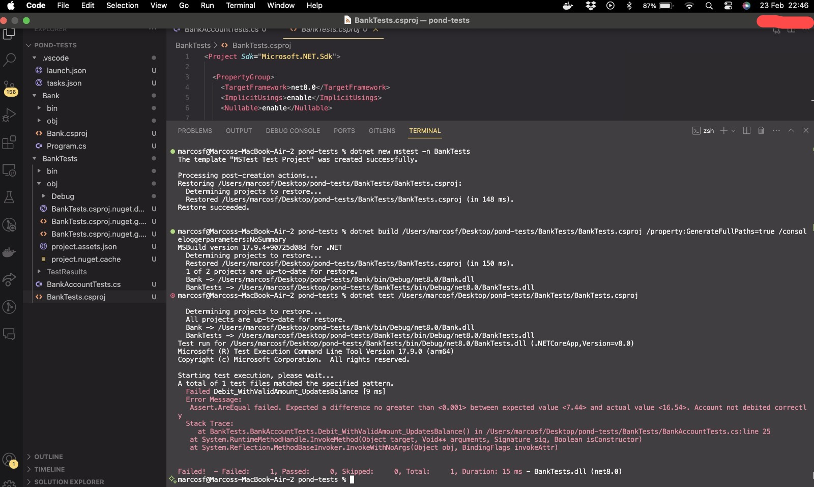
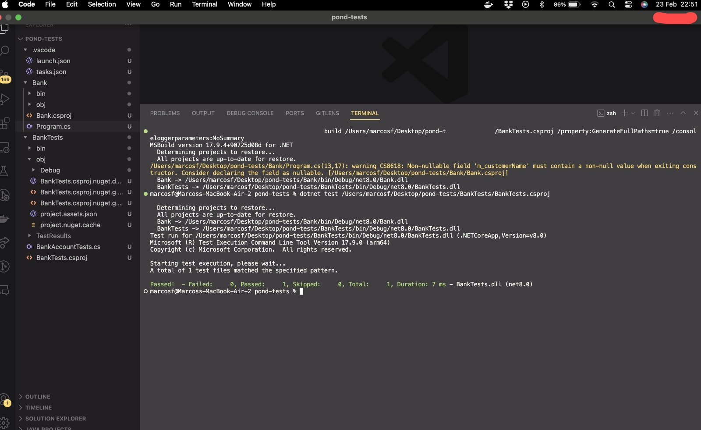
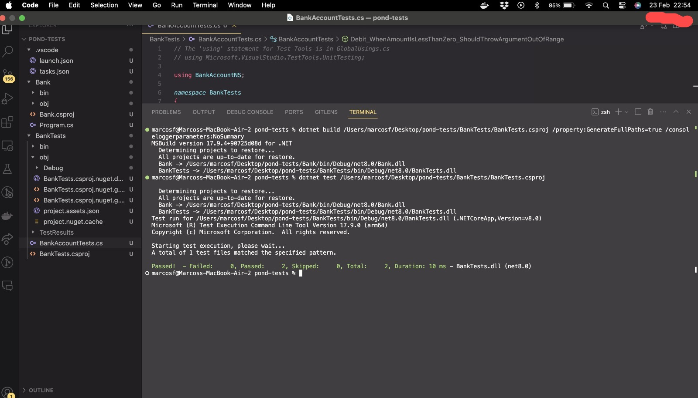
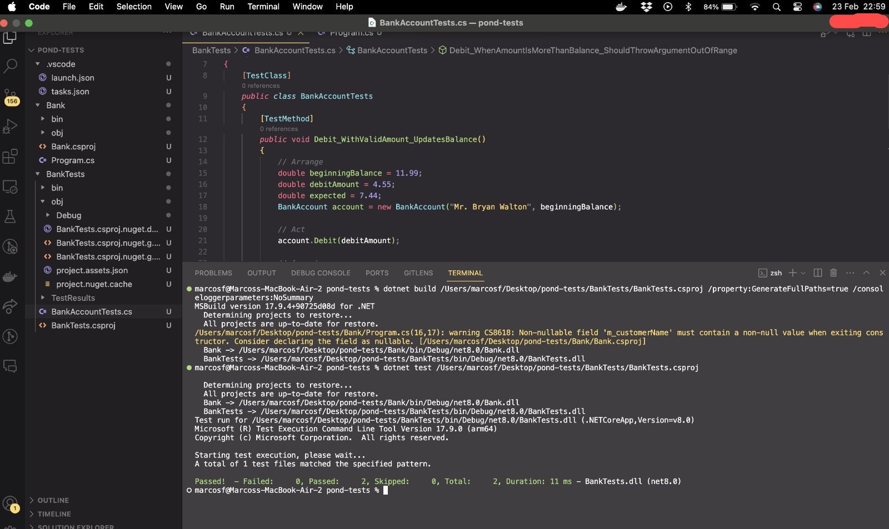
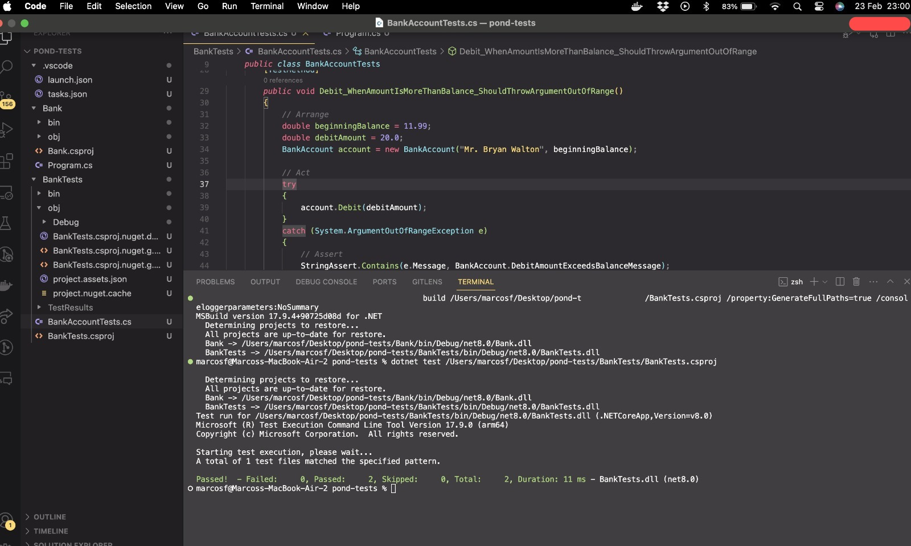

# Explicação da tecnologia

O framework .Net Core é uma plataforma de desenvolvimento de software livre e de código aberto desenvolvida pela Microsoft e pela comunidade .NET Foundation. Ele é um sucessor de código aberto do .NET Framework. O projeto é principalmente desenvolvido pela Microsoft e lançado sob a Licença MIT. O .NET Core é um framework modular que pode ser usado como um framework de aplicativo moderno, um framework de serviços em nuvem, um framework de IoT e um framework de dispositivos embarcados.

O .Net Core é estrutura em classes e bibliotecas que podem ser utilizadas para o desenvolvimento de aplicações web, mobile, desktop, jogos, entre outros. Ele é multiplataforma, ou seja, pode ser utilizado em sistemas operacionais Windows, Linux e macOS. Além disso, ele é open source, o que permite que a comunidade contribua para o seu desenvolvimento.

# Conceitos aprendidos

A linguagem C# é a principal linguagem de programação utilizada no .Net Core. Ela é uma linguagem de programação orientada a objetos, fortemente tipada e de alto nível. Ela é uma linguagem de programação moderna e possui uma sintaxe simples e limpa. Além disso, ela é uma linguagem de programação segura, pois possui um sistema de tipos que previne erros de compilação e execução.

O .Net Core possui uma arquitetura baseada em componentes, que são unidades de software que podem ser reutilizadas em diferentes aplicações. Ele possui uma arquitetura de camadas, que permite que as aplicações sejam divididas em diferentes camadas, como a camada de apresentação, a camada de negócios e a camada de dados. Além disso, ele possui uma arquitetura de serviços, que permite que as aplicações sejam divididas em diferentes serviços que podem ser consumidos por outras aplicações.

Embora não tenha sido usado no exercício, é interessante a utilização de injeção de dependência pelo .Net Core. A injeção de dependência é um padrão de projeto que permite que as dependências de um objeto sejam injetadas nele por meio de um contêiner de injeção de dependência. Isso permite que as dependências sejam substituídas por outras dependências sem a necessidade de alterar o código do objeto. Aprendi esse conceito trabalhando com NestJS, um framework para desenvolvimento de aplicações back-end em Node.js.

# Imagens

## Primeiro teste de aplicação .Net Core

Esse teste foi feito para verificar se o ambiente de desenvolvimento estava configurado corretamente. O resultado continha um erro, incluído propositalmente, para verificar se o ambiente de desenvolvimento estava configurado corretamente.

## Segundo teste de aplicação .Net Core

Esse teste foi realizado após a correção do bug do primeiro teste. O resultado foi positivo, indicando que o ambiente de desenvolvimento estava configurado corretamente.

## Terceiro teste de aplicação .Net Core

Esse teste representa a implementação de um teste unitário para verificar se a aplicação estava funcionando corretamente. O resultado foi positivo, indicando que a aplicação estava funcionando corretamente.

## Quarto teste de aplicação .Net Core

Esse teste foi realizado após a refatoração do código da aplicação. O resultado foi positivo, indicando que a refatoração do código foi bem sucedida.

## Quinto teste de aplicação .Net Core

Esse teste foi realizado após a refatoração de código do teste unitário. O resultado foi positivo, indicando que a refatoração do código do teste unitário foi bem sucedida.

